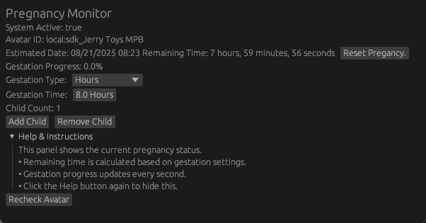

# Pregnancy OSC with OSC Query in 100% Rust
Providing Easy to use alternative from the Pregnancy OSC tool that didn't provide easy to use interface or customizability of the current progress of Pregnancy. Currently it has support with Acoenonoeti OSC-Based Fertility System and open source for anyone that wants to continue working on this.

# History
[OyasumiVR Oscquery](https://github.com/Toys0125/oyasumivr_oscquery/tree/Rust-OSCQuery) had some support for Rust and used a Sidecar Program in C#. I disliked needing to add the program with releases, so I made it entirely in Rust.
I also incorporated easy handler to allow others to expand functionality with ease. So, if someone wants to add more OSC functionality shouldn't be much of an issue.

