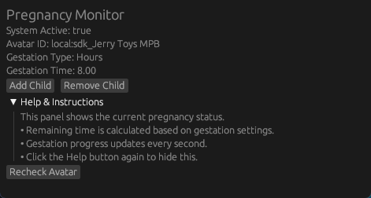

# Pregnancy OSC with OSC Query
Providing Easy to use alternative from the Pregnancy OSC tool that didn't provide easy to use interface or customizeablity of the current progress of Pregnancy. Currently has support with Acoenonoeti OSC-Based Fertility System and open source for anyone that wants to continue working on this.

